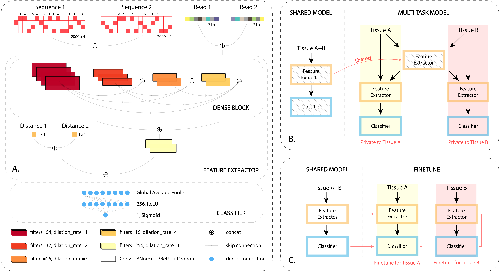
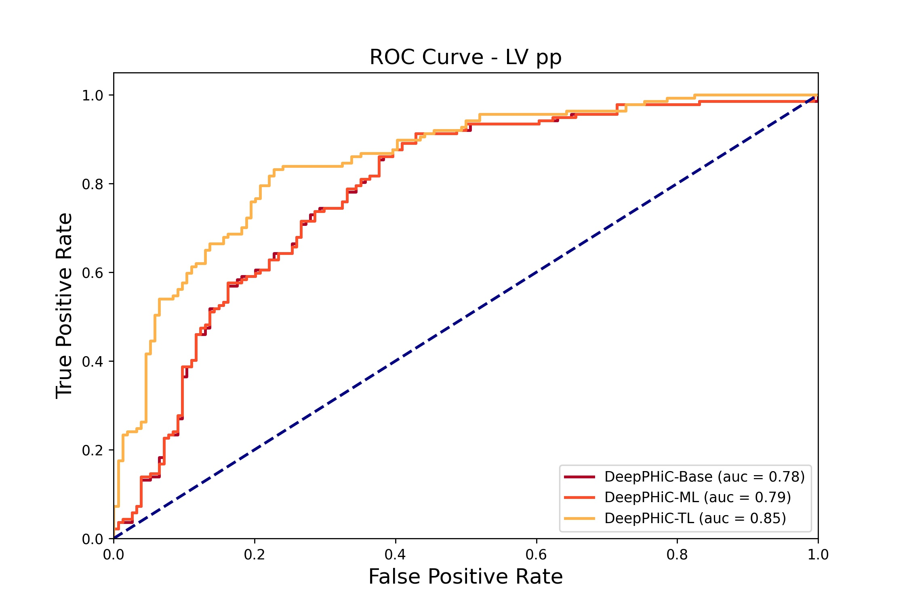

# DeepPHiC: Predicting promoter-centered chromatin interactions using a deep learning approach

Paper link: https://doi.org/10.1093/bioinformatics/btac801

We developed a supervised multi-modal deep learning model, which utilizes a comprehensive set of features including genomic sequence, epigenetic signals and anchor distance to predict tissue/cell type-specific genome-wide promoter-enhancer and promoter-promoter interactions. We further extend the deep learning model in a multi-task learning and transfer learning framework. We demonstrate that the proposed approach outperforms state-of-the-art deep learning approaches and robust to the inclusion of anchor distance. In addition, we find that the proposed approach can achieve comparable prediction performance using biologically relevant tissues/cell types compared to using all tissues/cell types especially for predicting promoter-enhancer interactions.

<p align="center"></p>
<p align="center">Figure 1. Overview of the DeepPHiC network.</p>

## Requirements

DeepPHiC is solely implemented on TensorFlow `2.6.0` using the Keras framework and Python `3.9.6`. The other requirements are:

```
h5py==3.1.0
matplotlib==3.4.3
numpy==1.19.3
numpy-utils==0.1.6
scikit-learn==0.24.2
tensorflow==2.6.0
```

## Usage

Download DeepPHiC

```bash
git clone https://github.com/amanbasu/DeepPHiC.git
```

Install requirements

```bash
pip install -r requirements.txt
```

You can learn more about the script arguments using the `-h` command for individual files

```
$ python train_base.py -h
usage: train_base.py [-h] [--type {pe,pp}] [--epochs EPOCHS] [--lr LR]
                     [--dropout DROPOUT] [--test TEST]

Arguments for training.

optional arguments:
  -h, --help         show this help message and exit
  --type {pe,pp}     interaction type
  --epochs EPOCHS    maximum training epochs
  --lr LR            learning rate
  --dropout DROPOUT  dropout
  --test TEST        test flag to work on sample data
```

### Train base model

To train one DeepPHiC-Base model per tissue. You can contol the promoter-promoter (pp) or promoter-enhancer (pe) interaction type using the `--type` argument. Set `--test False` if you want to train the model for all available tissues.

```bash
python train_base.py --type pp --epochs 1 --test True
```

### Train shared model

Shared models will use all the tissues for training as discribed in the Figure 1. When you train a shared model for one tissue, all the tissues will be used for training except that tissue, so that the training data does not leak into the testing data. All the shared models will be stored in the  `models/shared/` folder.

```bash
python train_shared_models.py --type pp --dropout 0.5 --test True
```

### Train fine-tune model

For training DeepPHiC-TL models. The model statistics (i.e. auroc, auprc, accuracy, fpr, and tpr) would be stored inside the `results/stats/` folder.

```bash
python train_finetune.py --type pp --lr 0.0001 --test True --train_full True
```

### Train multi-task model

For training DeepPHiC-ML models.

```bash
python train_multitask.py --type pp --lr 0.001 --test True
```

### Plot ROC curve

Reads the model statistics from the `results/stats/` folder and plots the ROC curves.

```bash
python plot_roc.py --type pp --tissue LV
```

<p align="center"></p>
<p align="center">Figure 2. ROC curve for LV tissue for promoter-promoter (pp) interaction.</p>


## Citation

```
@article{10.1093/bioinformatics/btac801,
    author = {Agarwal, Aman and Chen, Li},
    title = "{DeepPHiC: predicting promoter-centered chromatin interactions using a novel deep learning approach}",
    journal = {Bioinformatics},
    volume = {39},
    number = {1},
    year = {2022},
    month = {12},
    issn = {1367-4811},
    doi = {10.1093/bioinformatics/btac801},
    url = {https://doi.org/10.1093/bioinformatics/btac801},
    note = {btac801},
    eprint = {https://academic.oup.com/bioinformatics/article-pdf/39/1/btac801/48520967/btac801\_supplementary\_data.pdf},
}
```
